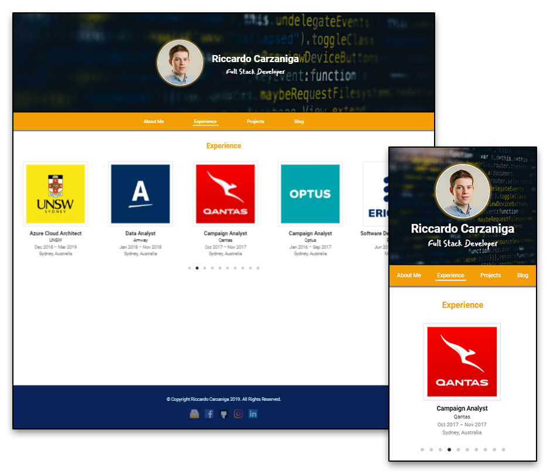
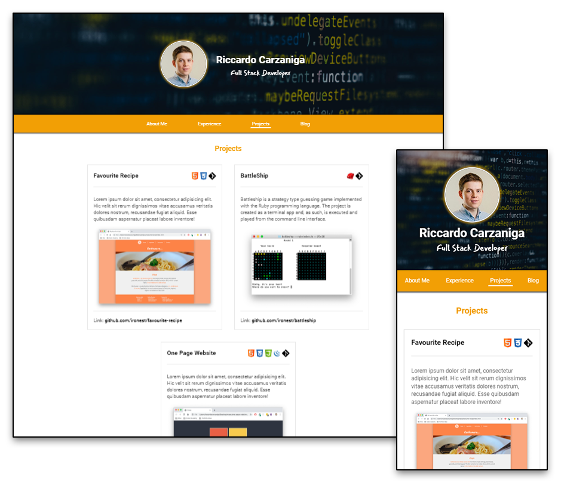

# portfolio-site

Live: [ironest.netlify.com](https://ironest.netlify.com)

Repo: [github.com/ironest/portfolio-site](https://github.com/ironest/portfolio-site)

Contributors: [Riccardo Carzaniga](https://github.com/ironest)

## Description

This repository contains my first professional online portfolio; it also serves as a diary to describe the process I followed to gather ideas, information and the actual steps I went through to create the website (design, planning, execution).

### Purpose

As an aspiring developer, it is important to be able to communicate and demonstrate your abilities to prospective employers. A great way to do this is to design, develop and deploy a website that showcases your talent, abilities and coding experience.

**The most important** aspect of having an online portfolio, is to show my expertise and showcase my work. It could also be beneficial in making a good impression to potential employers.
**Secondly**, it is desirable to have (or increase) an online presence so that, whoever looks up my name on a searching engine (e.g. google) my portfolio pops up. This will help me expanding my network and to develop my personal brand.
**Lastly**, with just a URL, I can infinitely extend my resume, adding as much content as I want, shaping it in whatever creative way I prefer, stepping outside of the traditional/boring/conservative plain PDF (or piece of paper).

### Functionality / features

  * Responsive Design
  * Fixed Navigation bar (in progress)

### Sitemap

The portfolio website is made of 4 webpages with landing page represented by the index.html which also serves as "About Me".
From there, any other webpage is reacheable through the navigation bar.

### Screenshots

### Target audience

My portfolio audience can be broken down into the following categories:
 * Potential employers
 * Internship providers
 * Peers such as:
    * Project Collaborators
    * Classmates
    * Friends & Family

As of now (September 2019) the website is only available in english language; as a consequence, the target audience is limited to English speakers but, due to my strong Italian roots, in future I could implement a parallel version for Italian speakers. No other demographics discrimination of age, gender, ability, sexual orientation, race or religion.

### Tech stack (e.g. html, css, deployment platform, etc)

The process involved using the following tools/tech:

  * **Design**
     * Balsamiq Mockups
     * Adobe Photoshop

  * **Development**
     * HTML
     * CSS
     * Javascript (pure vanilla)

  * **Deployment**
     * Git 
     * GitHub
     * Netlify