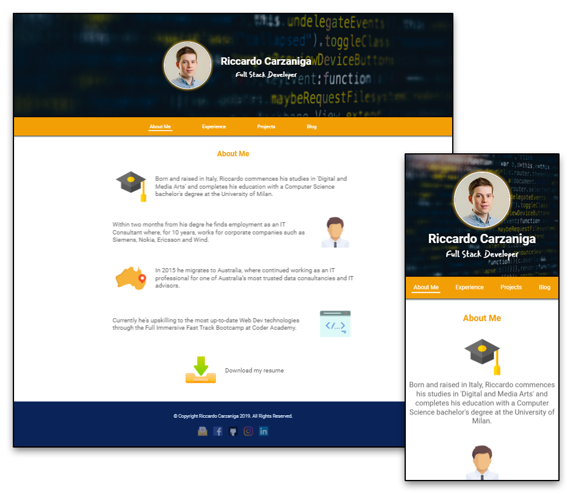

# portfolio-site

Live: [ironest.netlify.com](https://ironest.netlify.com)

Repo: [github.com/ironest/portfolio-site](https://github.com/ironest/portfolio-site)

Contributors: [Riccardo Carzaniga](https://github.com/ironest)

## Description

This repository contains my first professional online portfolio; it also serves as a diary to describe the process I followed to gather ideas, information and the actual steps I went through to create the website (design, planning, execution).

### Purpose

**The most important** aspect of having an online portfolio, is to show my expertise and showcase my work. It could also be beneficial in making a good impression to potential employers.
**Secondly**, it is desirable to have (or increase) an online presence so that, whoever looks up my name on a searching engine (e.g. google) my portfolio pops up. This will help me expanding my network and to develop my personal brand.
**Lastly**, with just a URL, I can infinitely extend my resume, adding as much content as I want, shaping it in whatever creative way I prefer, stepping outside of the traditional/boring/conservative plain PDF (or piece of paper).

### Functionality / features

  * Responsive Design
  The website is well structured and perfectly adapts to any device, without cutting any content from the viewport:
    * Smartphones
    * Tablet
    * Laptop
  * Carousel of my working experience
  Employers and Clients I worked for automatically scroll in a smooth carousel. Optionally, a user can interrupt the scroll by manually drag cards back and forth.
  * Blog post preview
  The 'blog' webpage provides a list of posts, showing:
    * Author name and avatar
    * Published date
    * Title of the post
    * Preview of the first line/lines of the post
    * Special button 'read more' to expand the post, revealing more text and imagages.
  * Fade-In animation of elements outside the viewport
    * As a webpage loads, not all the content is visible at once, because it might be outside the viewport. As soon as a user scrolls further down, more content appears in a smooth animation 'fade-in'
  * Extra themes and color/themes
  As part of the assesment, 3 more branches were requested to be created:
    * ghetto-style
    * warcraft
    * purples
  
### Sitemap

The portfolio website is made of 4 webpages with landing page represented by the index.html which also serves as "About Me".
From there, any other webpage is reacheable through the navigation bar.

### Screenshots

### Target audience

The target audience for my portfolio can be broken-down into the following categories:
  * Potential employers
  * Internship providers
  * Peers such as:
    * Project Collaborators
    * Classmates
    * Friends & Family
  
At the time of publication (September, 2019) the website is only available in English. Therefore, the target audience, is limited to English speakers. However, due to my strong Italian heritage, in the future, I wish to implement an identical version for Italian speakers.
My design does not discriminate against any users on the basis of age, gender, ability, sexual orientation, race or religion. It is my desire for my website to be as inclusive as possible.

### Tech stack (e.g. html, css, deployment platform, etc)

The process involved using the following tools/tech:

  * **Design**
     * Balsamiq Mockups
     * Adobe Photoshop

  * **Development**
     * HTML
     * CSS
     * Javascript (pure vanilla)

  * **Deployment**
     * Git 
     * GitHub
     * Netlify

## Project Management

### Wireframes

In the creation of my ‘portfolio project’, I implemented **mobile first** design principles. Mobile first, is a popular trend within the UX design and development communities. This paradigm involves designing a site (or an app) for mobile user initially and then scaling up for larger devices.
When implementing my wireframes (see below), I relied heavily on the use of **Flexbox** layouts. Flexbox, was the best solution as it gave me the ability to alter the height, width and order of my containers to best use the available space.
Due to the utility of Flexbox, once I implemented by mobile design, I was able to scale for desktop without needing to create an additional wireframe.

### Trello

Day 1 (17 September 2019)
This was the official project start date; I spent few hours assembling requirements and ideas around the main objective:
  * index page could be a summary, or about me
  * Projects or work experience or studies/education
  * Blog with at least 5 sample posts (placeholder text can be used), blog posts need to have at least ONE image each
  * A contact page with a big form taking the majority of the page

Day 3

Day 4

Day 6 (morning)

